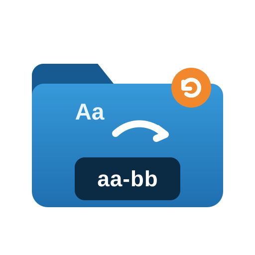

<p align="center">
  
</p>

# Share Name Normalizer for Unraid

An Unraid plugin that previews and bulk-renames user shares using this exact rule:

Created for Unraid by **Ray Munro**.

- capital letters become lowercase
- every ASCII space becomes a hyphen (`-`)

Example: `TV Shows` becomes `tv-shows`.

## Safety behavior

- Shows a complete preview before making changes.
- Refuses the whole batch if names collide or violate Unraid's naming rules.
- Skips digit-leading names such as `3D Stuff`, because Unraid will not accept `3d-stuff` as a renamed share.
- Requires the array to be started and Docker, VM services, and the mover to be stopped.
- Creates a configuration backup under `/boot/config/plugins/share-name-normalizer/backups/`.
- Uses unique temporary names so case-only renames are reliable.
- Attempts automatic rollback if any rename fails.

The plugin does not modify Docker templates, VM XML, scripts, backup jobs, media libraries, or client mappings. Update any saved paths that contain an old share name after renaming.

Current release: **2026.09.02b**.

Copyright © 2026 Ray Munro. Licensed under the [GNU GPLv3](LICENSE).

## Installation

**Via Community Applications:** search for "Share Name Normalizer" in the
Apps tab and click Install.

**Manually:** in the Unraid webGUI go to **Plugins → Install Plugin** and
paste:

```
https://raw.githubusercontent.com/RayMunro/unraid-share-name-normalizer/main/share-name-normalizer.plg
```

or from the terminal:

```bash
plugin install https://raw.githubusercontent.com/RayMunro/unraid-share-name-normalizer/main/share-name-normalizer.plg
```

Open **Settings → User Utilities → Share Name Normalizer**. The package
is embedded directly in the `.plg`, so nothing else needs to be downloaded
or copied by hand.

## Build

```bash
./build.sh
bash tests/verify-build.sh
```

## Uninstall

```bash
plugin remove share-name-normalizer.plg
```

Backups are intentionally preserved on the flash drive.
